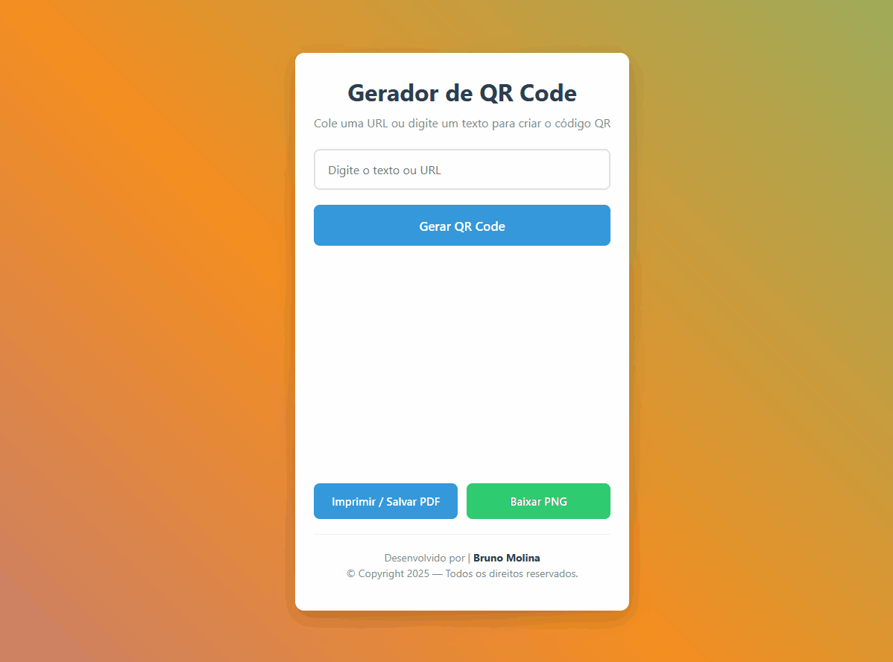
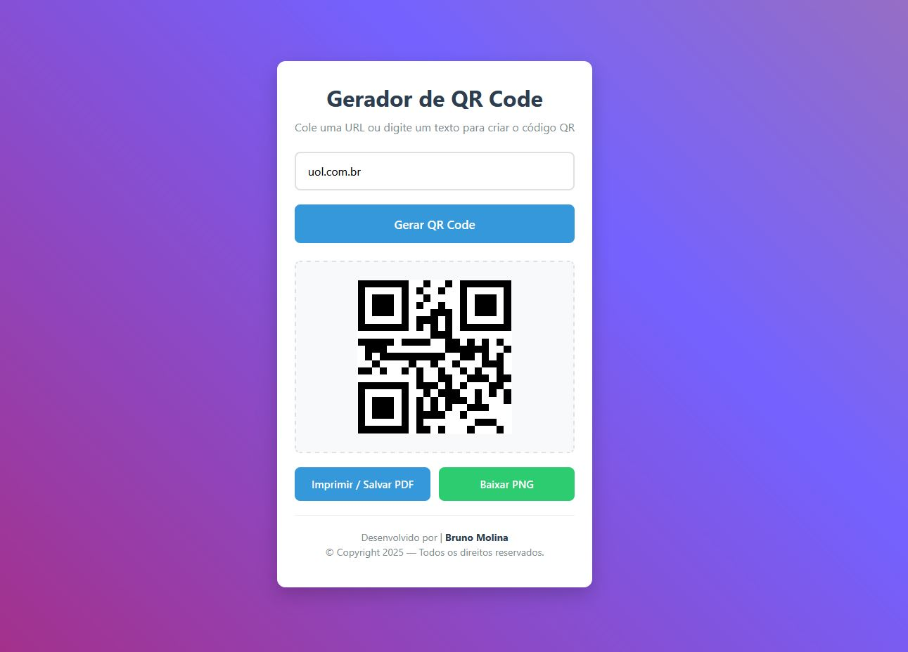

# Gerador de QR Code

Um gerador de QR Code simples e eficiente desenvolvido em HTML, CSS e JavaScript.

## API 

Site: https://goqr.me/api/

## Funcionalidades

- ✅ Geração instantânea de QR Codes
- ✅ Opção para imprimir ou salvar como PDF
- ✅ Download da imagem em PNG
- ✅ Design responsivo
- ✅ Interface moderna com gradiente animado
- ✅ Validação de entrada

## Como usar

1. Digite uma URL ou texto no campo de entrada
2. Clique em "Gerar QR Code" ou pressione Enter
3. Use os botões para imprimir/salvar PDF ou baixar PNG

## Estrutura do Projeto

